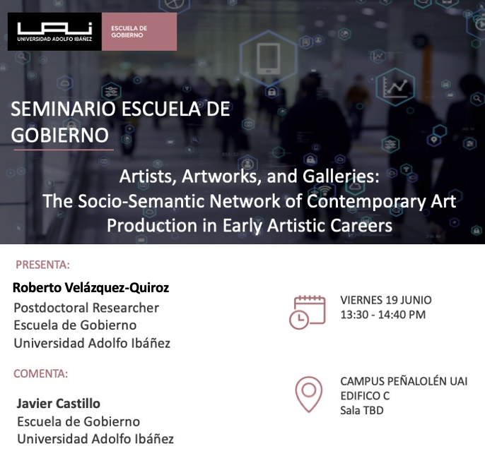

 

{width="70%" fig-align="center"}

 

Last Friday I had the chance to present my latest research at the Escuela de Gobierno's seminar series at Universidad Adolfo Ibáñez, with Javier Castillo generously offering comments. The talk, "Artists, Artworks, and Galleries: The Socio-Semantic Network of Contemporary Art Production in Early Artistic Careers," asks a deceptively simple question: **what actually connects an artist to the themes they choose to work with?** Rather than treating artistic content as a byproduct of individual inspiration or as something imposed top-down by institutions, I argue it emerges relationally — through a duality between artists and the aesthetic content they produce, in the spirit of Georg Simmel's form/content distinction and Ronald Breiger's classic model of two-mode networks.

Empirically, the paper draws on Chile's National Collection of Contemporary Artists (NCCA), a state acquisition program launched during the pandemic, focusing on 250 early-career artists. I used Structural Topic Modeling to extract 15 aesthetic themes from artists' own descriptions of their work — everything from Political Memory and Queer Identities to Environmental Impact and the Covid-19 Pandemic — and then built a two-mode network linking artists to these themes. A key methodological piece is a visibility measure, built from a two-mode relational similarity approach, that captures how prominent the galleries exhibiting each theme's artworks tend to be, letting me classify content as niche, emergent, or mainstream.

The core findings, tested through Exponential Random Graph Models, tell a story of stratification hiding behind an apparently open symbolic market. **Early-career artists cluster around a narrow set of themes rather than spreading across many — a sign of deliberate differentiation rather than broad experimentation. Mainstream, institutionally visible content attracts fewer artists but higher acquisition rates, while niche content is more widely produced but less rewarded.** And access to that mainstream space isn't distributed evenly: gender, academic (versus technical or self-taught) art education, private sponsorship, and critical reception all significantly shape which artists get to engage with high-visibility themes, with homophily effects showing that artists sharing similar backgrounds tend to converge on similar content.

For me, the bigger takeaway is methodological as much as substantive: combining topic modeling with network models like ERGM gives sociologists of culture a genuinely relational way to study meaning-making, one that avoids reducing creativity either to pure individual agency or to institutional determinism. It's a framework I think travels well beyond visual art — to music genres, literary movements, or digital content ecosystems — anywhere we want to understand how symbolic content and social position co-produce each other. Thanks again to everyone who came out and to Javier for a sharp set of comments that are already shaping the next round of revisions.
