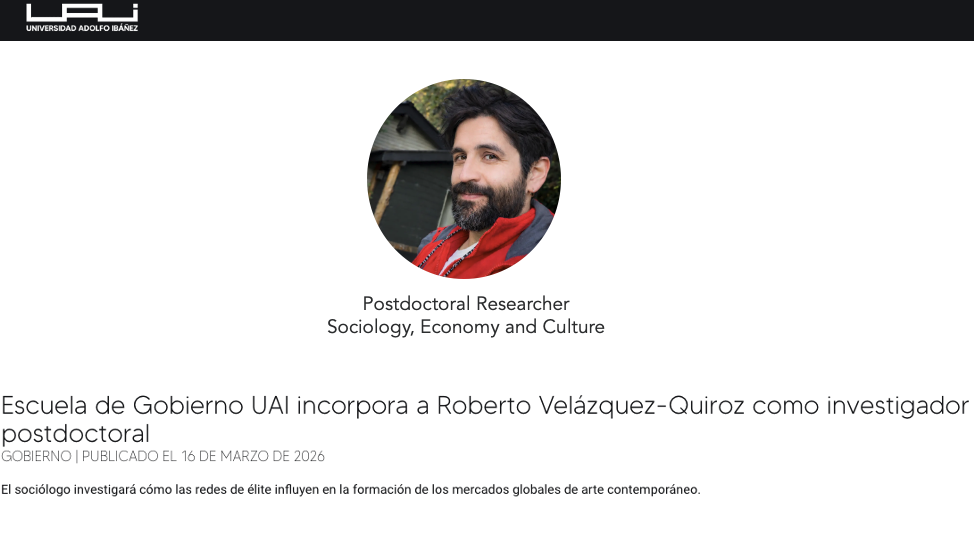

 

{width="70%" fig-align="center"}

 

A sociologist and historian from the Pontificia Universidad Católica de Chile, Roberto Velázquez-Quiroz has joined the Escuela de Gobierno at Universidad Adolfo Ibáñez as a postdoctoral researcher, where he will conduct research on elite networks and their influence on contemporary cultural markets.

Velázquez-Quiroz earned his Ph.D. in Sociology from the Pontificia Universidad Católica de Chile and holds graduate degrees in Global History (M.A.) from Columbia University and Cultural Sociology (M.Sc.) from the London School of Economics and Political Science. His academic work sits at the intersection of computational social science, social network analysis, text mining and analysis, statistical methods, cultural sociology, and social theory.

His research has been recognized and funded by several international institutions, including the Institute of Latin American Studies (ILAS) at Columbia University, the Alliance Program Fellowship at the London School of Economics, the Museum of Modern Art (MoMA) in New York, the Rockefeller Archive Center at the Rockefeller Foundation, and the Beinecke Rare Book & Manuscript Library at Yale University. He has also published in international journals such as *Cold War History* and the *Berkeley Journal of Sociology*, and has taken part in international academic initiatives such as the SICSS program at the University of California, Los Angeles.

He is currently developing the postdoctoral project **"A Taste for the Few: Elite Networks, Cultural Influence, and the Structural Formation of Contemporary Art Markets" (FONDECYT N°3260037)**, in collaboration with Escuela de Gobierno UAI faculty member Naim Bro. He is also an associate researcher at the Millennium Institute for Foundational Research on Data (IMFD).

Regarding his arrival at the Escuela de Gobierno, Velázquez-Quiroz notes that one of the main factors motivating him was the chance to join an academic community known for its rigor and its commitment to public impact. **"My interest in carrying out my postdoctoral research at the UAI Escuela de Gobierno was driven by the opportunity to be part of an academic community with first-rate research, thematic and methodological innovation, and a strong commitment to public impact,"** he explains.

The research he will carry out at UAI examines the role of political-cultural elites in shaping contemporary art markets worldwide. To this end, the project analyzes data from 15 countries using advanced computational analysis techniques, combining topic modeling tools and complex network analysis to study how influential actors—institutions, curators, collectors, and cultural agents—shape international circuits of cultural legitimation.

From his perspective, understanding these dynamics is key to broadening the debate on public policy and governance. **"If decisions about what gets funded, what gets exhibited, or what circulates internationally are not random, then ignoring the role of cultural elites means underestimating one of the central mechanisms through which economic hierarchies are reproduced and political agendas are shaped,"** he argues.

The researcher hopes that his work will contribute both to the international academic debate on the sociology of elites and cultural markets, and to the design of public policy informed by the power structures that shape the production and circulation of symbolic goods. **"Understanding how elites build and sustain networks of influence through institutions and cultural spaces sheds light on mechanisms of power that often operate alongside the state's formal channels,"** he concludes.

With this appointment, the Escuela de Gobierno at Universidad Adolfo Ibáñez continues to strengthen its research agenda in advanced social science and its international reach in the study of complex phenomena linking culture, economy, and politics.

[Read the original news article at uai.cl](https://www.uai.cl/noticias/gobierno/escuela-de-gobierno-uai-incorpora-a-roberto-velazquez-quiroz-como-investigador-postdoctoral)
